# The `<table>` Tag in HTML

Hola geeks! Imagine a mystical realm within web development, where the table tags are like magic builders which create detailed grids of information, so let's go and learn more about them.

## `<table>` tag

The `<table>` element describes an HTML table.
The `<table>` element contains `<tr>, <th>` and `<td>` elements.
It can also contain optional `<tbody>, <tfoot>, <col>, <thead>, <colgroup>` and `<caption>` elements.
This tag supports global attributes in HTML.
Here's a skeleton:

```html
<table>
  <!-- Table elements go here -->
</table>
```

### HTML Table tags

| S.No | Tab          | Description                                                               |
| ---- | ------------ | ------------------------------------------------------------------------- |
| 1    | `<table>`    | `Defines a table `                                                        |
| 2    | `<th>`       | `Defines a header in a table`                                             |
| 3    | `<tr>`       | `Defines a row in a table`                                                |
| 4    | `<td>`       | `Defines a cell in a table`                                               |
| 5    | `<caption>`  | `Defines a table caption`                                                 |
| 6    | `<colgroup>` | `Specifies a group of one or more columns in a table for formatting`      |
| 7    | `<col>`      | `Specifies column properties for each column within a <colgroup> element` |
| 8    | `<thead>`    | `Groups the header content in a table`                                    |
| 9    | `<tbody>`    | `Groups the body content in a table`                                      |
| 10   | `<tfoot>`    | `Groups the footer content in a table`                                    |

## Sections of a Table

Your table can be divided into three main sections:

### 1. `<thead>`

This is the table header. It usually contains column names or labels. Anything you put here appears at the top of the table.

```html
<table>
  <thead>
    <tr>
      <th>Name</th>
      <th>Age</th>
      <th>Email</th>
    </tr>
  </thead>
  <!-- More sections -->
</table>
```

Output:

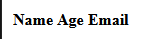

[Go check it out :)](https://codesandbox.io/s/pensive-austin-4z2frw?file=/index.html)

### 2. `<tbody>`

The bulk of your data goes here, in the table body.

```html
<table>
  <!-- ... -->
  <tbody>
    <tr>
      <td>John</td>
      <td>30</td>
      <td>john@example.com</td>
    </tr>
  </tbody>
</table>
```

Output:

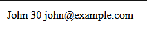

[Go check it out :)](https://codesandbox.io/s/peaceful-chihiro-m48nf5?file=/index.html)

### 3. `<tfoot>`

Rarely used but important for semantic reasons, the table footer often contains summary rows or notes.

```html
<table>
  <!-- ... -->
  <tfoot>
    <tr>
      <td colspan="2">Total People</td>
      <td>1</td>
    </tr>
  </tfoot>
</table>
```

Output:

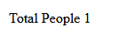

[Go check it out :)](https://codesandbox.io/s/hardcore-sound-t3f8gj?file=/index.html)

## Table Row: `<tr>`

Rows are created using the `<tr>` tag. Every `<tr>` can contain multiple cells (`<td>` or `<th>`), one for each column.

```html
<tr>
  <td>Data 1</td>
  <td>Data 2</td>
</tr>
```

Output:

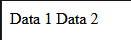

[Go check it out :)](https://codesandbox.io/s/hungry-paper-jq7mqh?file=/index.html)

## Table Cell

You've got two types of cells:

### 1. `<th>`

This stands for "table header." Use it for column or row headings.

```html
<th>Column Title</th>
```

Output:

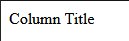

[Go check it out :)](https://codesandbox.io/s/cool-rain-3x2cv3?file=/index.html)

### 2. `<td>`

Short for "table data," this is where your actual content goes.

```html
<td>Your data here</td>
```

Output:


[Go check it out :)](https://codesandbox.io/s/gracious-chatelet-6n4rhw?file=/index.html)

## Attributes

| S No. | Attributes and Tags  | Illustrations                                |
| ----- | -------------------- | -------------------------------------------- |
| 1     | Define Table         | `<table>..</table>`                          |
| 2     | Add caption          | `<caption>..</caption>`                      |
| 3     | Table row            | `<tr>..</tr>`                                |
| 4     | Table header         | `<th>..</th> `                               |
| 5     | Table Data in a cell | `<td>..</td>`                                |
| 6     | Cell spacing         | `<table cellspacing="">...</table>`          |
| 7     | Cell padding         | `<table cellpadding="">...</table>`          |
| 8     | Table border         | `<table border="">...</table>`               |
| 9     | Alignment            | `<table align=center/left/right>...</table>` |
| 10    | colspan in table     | `<table colspan="">...</table>`              |
| 11    | rowspan in table     | `<table rowspan="">...</table>`              |
| 12    | Cell color           | `<table bgcolor="#$$$$$$">...</table>`       |
| 13    | No linebreaks        | `<table nowrap>...</table> `                 |

## HTML Table with colspan

Colspan is an attribute which assigns multiple columns to a cell of a table. The number of columns depends on the value entered by you in colspan="" attribute.

```html
<table>
  <tr>
    <th>Name</th>
    <th colspan="2">Jobs</th>
    <th>Working Experience</th>
  </tr>
  <tr>
    <td>John</td>
    <td>Software Engineer</td>
    <td>Data Analyst</td>
    <td>5 Years</td>
  </tr>
  <tr>
    <td>Ale</td>
    <td colspan="2">Senior Web developer</td>
    <td>2 Year</td>
  </tr>
  <tr>
    <td>Jack</td>
    <td>Junior Tech Writer</td>
    <td>Blogger</td>
    <td>6 Months</td>
  </tr>
</table>
```

Output:

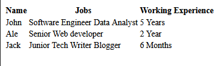

[Go check it out :)](https://codesandbox.io/s/quirky-browser-3d5cj5?file=/index.html)

## HTML Table with rowspan

Rowspan in table, works similar to the clospan for columns, but here, we assign multiple rows to a cell using an attribute rowspan="" .

```html
<table>
  <tr>
    <th>Name</th>
    <th colspan="2">Jobs</th>
    <th>Working Experience</th>
  </tr>
  <tr>
    <td>John</td>
    <td>Software Engineer</td>
    <td>Data Analyst</td>
    <td rowspan="2">5 Years</td>
  </tr>
  <tr>
    <td>Ale</td>
    <td colspan="2">Senior Web developer</td>
  </tr>
  <tr>
    <td>Jack</td>
    <td>Junior Tech Writer</td>
    <td>Blogger</td>
    <td>6 Months</td>
  </tr>
</table>
```

Output:

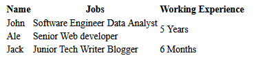

[Go check it out :)](https://codesandbox.io/s/naughty-platform-43y9c6?file=/index.html)

## HTML Table with caption/heading

In a HTML table, caption is simply the title of the table. For this, HTML <caption></caption> tag can be used.

```html
<table>
  <caption>
    New Employees Records
  </caption>
  <tr>
    <th>Name</th>
    <th colspan="2">Jobs</th>
    <th>Working Experience</th>
  </tr>
  <tr>
    <td>John</td>
    <td>Software Engineer</td>
    <td>Data Analyst</td>
    <td rowspan="2">5 Years</td>
  </tr>
  <tr>
    <td>Ale</td>
    <td colspan="2">Senior Web developer</td>
  </tr>
  <tr>
    <td>Jack</td>
    <td>Junior Tech Writer</td>
    <td>Blogger</td>
    <td>6 Months</td>
  </tr>
</table>
```

Output:

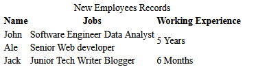

[Go check it out :)](https://codesandbox.io/s/upbeat-solomon-z3y799?file=/index.html)

## HTML Table with background color

```html
<table>
  <tr>
    <th>Name</th>
    <th>Jobs</th>
    <th>Working Experience</th>
  </tr>
  <tr>
    <td>John</td>
    <td>Software Engineer</td>
    <td>5 Years</td>
  </tr>
  <tr id="eligible" bgcolor="#0bb31e">
    <td>Ale</td>
    <td>Senior Web developer</td>
    <td>2 Year</td>
  </tr>
</table>
```

Output:

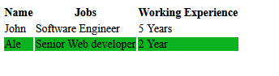

[Go check it out :)](https://codesandbox.io/s/practical-platform-szvp8x?file=/index.html)

## Nested Tables

In HTML, a nested table refers to the practice of placing one table inside another table. This means you have a table within a table. This technique is often used to achieve more complex layouts or to structure data in a hierarchical manner.

For example, you might have a main table that contains different sections, and within each section, you can use nested tables to organize and present data in a more organized and visually appealing way.

Here's an example of nested tables-

```html

<table>
    <caption>Nested Tables</caption>
    <tr>
        <th>Header of Table 1</th>
        <th>Header of Table 2</th>
    </tr>

    <tr>
        <td>
            <table>
                <tr>
                    <th>1st Header NT1</th>
                    <th>2st Header NT1</th>
                </tr>
                <tr>
                    <td>1st cell of nested table</td>
                    <td>2st cell of nested table</td>
                </tr>
                <td>3rd cell of nested table</td>
                <td>4th cell of nested table</td>
    </tr>

</table>
</td>
<td>
    <table>
        <tr>
            <th>1st Header of nested table 2</th>
            <th>2st Header of nested table 2</th>
        </tr>
        <tr>
            <td>1st cell of nested table</td>
            <td>2st cell of nested table</td>
        </tr>
        <td>3rd cell of nested table</td>
        <td>4th cell of nested table</td>
        </tr>
    </table>
</td>
</tr>
</table>
```

Output:

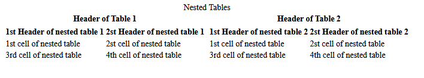

[Go check it out :)](https://codesandbox.io/s/recursing-kilby-jg4q9z?file=/index.html)

## Table Alignment

### Horizontal Alignment

The text-align property sets the horizontal alignment (like left, right, or center) of the content in <th> or <td>.

By default, the content of <th> elements are center-aligned and the content of <td> elements are left-aligned.

To center-align the content of <td> elements as well, use text-align: center:

```css
td {
  text-align: center;
}
```

Output:

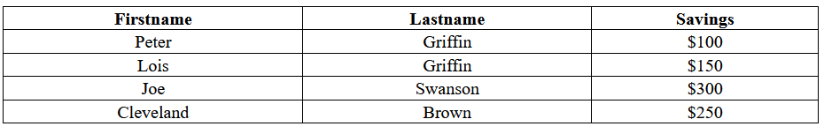

To left-align the content, force the alignment of <th> elements to be left-aligned, with the text-align: left property:

```css
th {
  text-align: left;
}
```

Output:

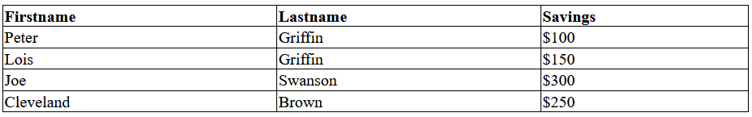

### Vertical Alignment

```css
td {
  height: 50px;
  vertical-align: bottom;
}
```

Output:

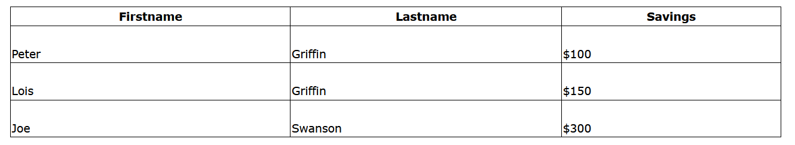

## Table Size

### Table height and width

The width and height of a table are defined by the width and height properties.

The example below sets the width of the table to 100%, and the height of the <th> elements to 70px:

```css
table {
  width: 100%;
}
th {
  height: 70px;
}
```

Output:

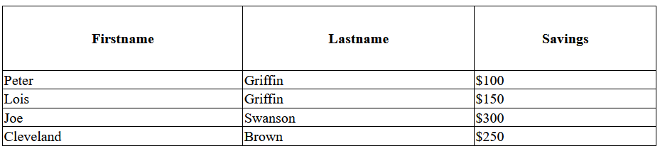

To create a table that should only span half the page, use width: 50%:

```css
table {
  width: 50%;
}
```

Output:

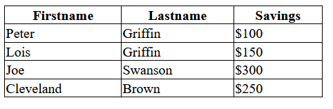

And there you have it! You're now well-equipped to create tables in HTML. Happy coding!
